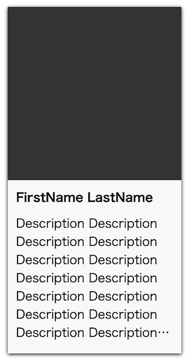

# React とは？

「ユーザインターフェース構築のための JavaScript ライブラリ」です。

1. 宣言的なView（Declarative）
2. コンポーネントベース（Component-based）
3. 一度学習すれば、どこでも使える（Learn Once, Write Anywhere）


# React登場前のWebアプリ開発の現場

主に以下の問題が多くの現場で発生していました。

* 実装の協調を保つエンジニアがいないため、アプリ実装がカオス化していた
  * 炎上リスク
  * 修正によるデグレの発生
* DOM操作に関する理解不足によるパフォーマンス劣化

各年代ごとの状況を見ていきます。


## 1990年代後半〜現在： Vanilla.js

Vanilla.js という名前は、ジョークサイトが由来です。

http://vanilla-js.com/

ライブラリサイズが「0バイト」、パフォーマンス最速を歌っています。

JavaScriptのDOM APIを駆使してプログラミングしていく、プログラミングスタイルの総称として
この名前が使われることもあります。

DOMを使いこなしてプログラミングしていくため、DOM職人と呼ばれたりします。
局所的には高速である反面、大規模なWebアプリケーション開発では、細かなプログラミングルールを決めておく必要があり、また全体の設計・実装を理想的なかたちに保っていくことが難しい側面を持っています。場合によっては、
パフォーマンスの劣化を招きます。独自のフレームワークを構築していくことになるため、時が経過するとメンテナンスが困難になるという問題もあります。

## 2000年代〜現在： jQuery

クロスブラウザ対応のDOMユーティリティライブラリ。

2000年代のブラウザは、IE、Firefox、Safari、Chrome等のブラウザごとにDOM APIの定義の有無や挙動が異なるという状況が続いていました。そこで登場したのが、jQueryです。jQueryは各ブラウザの差分を吸収したAPIを提供します。

スタティックなサイトのWebデザインに jQuery は広く普及しています。とくに、Webデザイナが好んで使用しています。

Webアプリの開発においても、jQueryが使われていたことがあります。ただし、jQueryのバイトサイズが比較的大きいため、現在ではあまり好まれていません。また、モダンブラウザでは、旧来の挙動の違いが解消されてきたので、jQueryの役割は終えつつあります。

ACCESSでは、jQueryを新規のWebアプリケーション開発で利用することはありません。


## 2010年代前半〜現在： 命令型 MVC、MVVMフレームワーク

jQueryとは異なり、アプリケーションの開発を目的としたフレームワークが数多く登場したのはこの時期です。
弊社では、一時期、Backbone.js という名前の MVC ライブラリが多くの案件で利用されていました。

このようなフレームワークの多くは、jQueryと同様に命令型のプログラミングスタイルです。そのため、大規模なWebアプリケーションの開発では、実装が複雑化してしまう問題を孕んでいます。ユニットテストの実装も難しくなる問題もありました。


# この状況を解決するのが React

Reactでは、以下の課題を解決します。

* 宣言的にUIをプログラミングできる
* DOMのパフォーマンス劣化の改善
* 大人数の大規模アプリケーション開発に優れている


Reactは、世界で最も人気のあるViewライブラリです。そのため、OSSの世界では多くの知見があります。
絶えず開発が続けられており、今後の成長も見込めます。

ACCESSでは、Webアプリケーション開発で React の利用を推奨しています。
社内の多くの案件で利用されているため、本研修で学んだことが配属先の現場で必ず役に立つでしょう。

## roadmap.sh/frontend

https://roadmap.sh/frontend


# とりあえずはじめてみるには？

Reactの一番短いコード（[CodePen](https://codepen.io/aseijiurushihara/pen/XWmmKPw?editors=0010)）の例が下記です。

```javascript
ReactDOM.render(<h1>Hello, world!</h1>, document.body)
```


選択肢としては、3つの方法があります。

## Online Playground を使う

* [CodePen](https://codepen.io/)
* [CodeSandbox](https://codesandbox.io/index2)
* [JSFiddle](https://jsfiddle.net/)

研修では、CodePenを利用します。


## scriptタグ（Reactライブラリ) をサイトに追加する

* Add React to a Website
  * https://ja.reactjs.org/docs/add-react-to-a-website.html

デバッグ情報を多く含んでいるため、サイズが大きいです。
プロダクト向けの方法ではありません。

## create-react-app で環境を構築する

https://github.com/facebook/create-react-app

今後、Reactアプリケーションを新規に構築する場合は、create-react-app コマンドを利用することを推奨します。

（研修では、このコマンドを実行することはありません）


# 【課題0-1】vanillaJSでHTML/CSSを構築してみよう

以下のCardデザインイメージをvanillaJSで構築してください。

* 目的： DOM API を使ってみて、Reactを採用する理由を体感するため
* 制限： OSS、TypeScriptは利用しない
* デザインイメージ
  

## Step 1: DOMツリーを構築する

以下のDOMツリーをDOM APIを使って構築してください（[Fork](https://codepen.io/aseijiurushihara/pen/WNQYYEQ) : TypeScriptは使いません）

なお、本課題では、`innerHTML` を使うことは禁止とします。HTMLコメント（`<!-- コメント -->`）の出力は不要です。

```html
<body>
  <div id="app">
    <!-- card -->
    <div>
      <!-- avatar -->
      <div></div>
      <!-- name -->
      <p></p>
      <!-- description -->
      <p></p>
    </div>
  </div>
</body>
```

**ヒント**

* id属性のElementオブジェクトを取得する（[MDN](https://developer.mozilla.org/ja/docs/Web/API/Document/getElementById)）
  ```javascript
  const element = document.getElementById(id)
  ```
* tagNameで指定したHTML要素を生成する（[MDN](https://developer.mozilla.org/ja/docs/Web/API/Document/createElement)）
  ```javascript
  const element = document.createElement(tagName)
  ```
* 親Nodeの子Nodeリストの最後にNodeを追加する（[MDN](https://developer.mozilla.org/ja/docs/Web/API/Node/appendChild)）
  ```javascript
  const childElement = parentElement.appendChild(childElement)
  ```
* card、avatar、name、descriptionを連想する変数名を付けるのがよいでしょう。

## Step 2: スタイルとテキストを適用する

下記のような内容となるようにスタイルとテキストを適用してください。
スタイルはあらかじめ定義済みです。

```html
<body>
  <div id="app">
    <div class="card">
      <div class="avatar"></div>
      <p class="name">FirstName LastName</p>
      <p class="description">Description Description ...略</p>
    </div>
  </div>
</body>
```

**構文ヒント**

* 要素にCSSセレクターを取得/適用する（[MDN](https://developer.mozilla.org/ja/docs/Web/API/Element/className)）
  ```javascript
  elementNodeReference.className = cName   // cNameは文字列
  ```
* 要素にテキストコンテントを取得/適用する（[MDN](https://developer.mozilla.org/ja/docs/Web/API/Node/textContent)）
  ```javascript
  elementNodeReference.textContent = text  // textは文字列
  ```